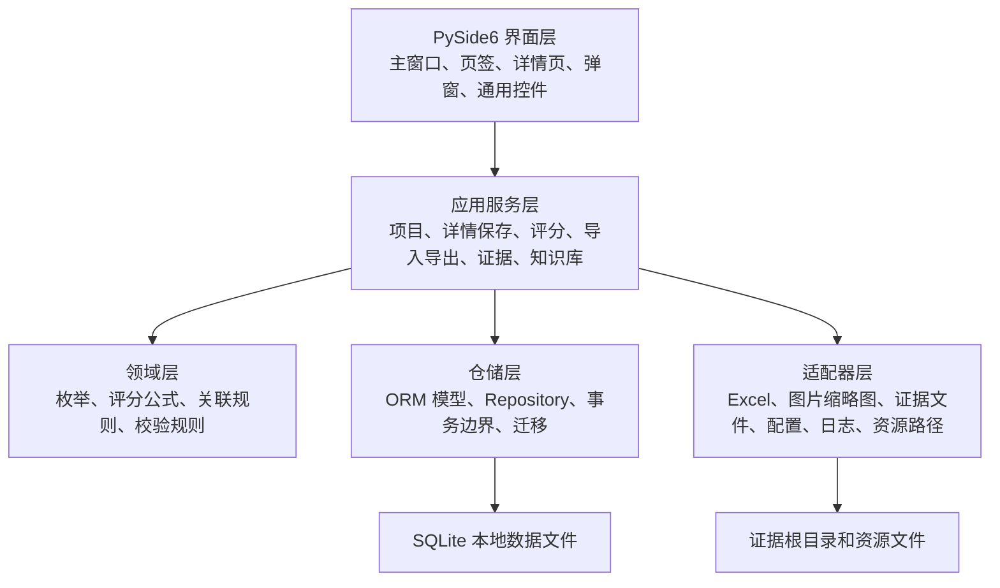
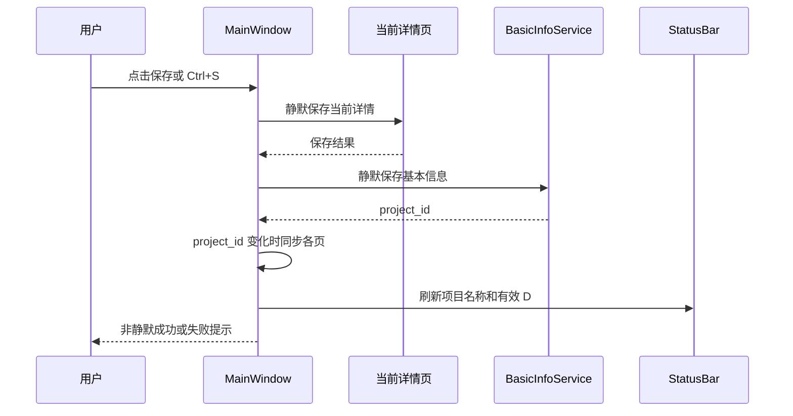

# 商用密码应用安全性评估实施工具开发设计方案

> 依据：`开发需求文档.md`
>
> 日期：2026-06-23
>
> 设计定位：把需求文档中的当前功能、协议、兼容行为和验收口径转化为可开发、可测试、可维护的系统设计方案。

## 1. 需求理解

本工具是面向商用密码应用安全性评估工作的 Windows 本地桌面实施工具。它不是简单的数据录入表单，而是围绕一个评估项目，把系统信息、四类技术域测评对象、量化评估、风险判定、密码产品、证据图片、知识库、评分、Excel 导入导出和问题清单生成串成完整工作流。

需求文档的重点不只是“要实现哪些功能”，还明确记录了大量当前行为协议：

- 页面切换、手动保存、自动保存、评分刷新各自的保存边界不同。
- 详情页只读加载不得修改数据，评分页刷新却需要兼容补建缺失量化评估记录。
- 量化评估和证据通常关联测评单元详情，密码产品存在“外层对象”和“详情记录”并存的历史关联语义。
- Excel 模板、打分表和问题清单的 sheet 名称、列顺序、合并单元格、颜色、空值表达都属于验收范围。
- 证据图片文件存储在磁盘目录，本地数据库只保存文件名、排序和业务关联，允许记录和磁盘文件出现非强一致。

因此，本方案的设计目标是“行为等价优先、边界清晰、逐步可测试”，而不是对业务语义做激进重构。

## 2. 范围与非目标

### 2.1 实施范围

- Windows 本地桌面应用启动、主窗口、菜单、工具栏、状态栏和业务页签。
- 项目新建、打开、保存、软删除、恢复和内部硬删除服务。
- 基本信息、子系统、密码应用情况维护。
- 物理和环境安全、设备和计算安全、网络和通信安全、应用和数据安全四类技术域对象与详情维护。
- 通用量化评估、风险判定、知识库回填、密码产品列表、证据入口和普通图片上传组件。
- 41 项指标配置、技术域评分、管理域评分、总分计算和评分汇总持久化。
- 访谈模板导入、评估数据导出、打分表导入导出、问题清单导出、知识库导入导出。
- 本地数据初始化、迁移、兼容清理、关联完整性检查、日志和安装包资源支撑。

### 2.2 非目标

- 不改成多人协作、云端同步或 Web SaaS。
- 不改变需求文档中记录的现有评分公式、Excel 协议、证据命名规则和历史关联语义。
- 不把项目软删除入口改为硬删除。
- 不自动修复证据磁盘文件和数据库记录不一致的问题，只提供容错展示和诊断能力。
- 不在详情页只读加载过程中创建、修改、提交或回滚数据。

## 3. 方案比较与推荐

### 3.1 推荐方案：Python + PySide6 + SQLite 的本地分层桌面架构

推荐使用 PySide6 构建本地桌面界面，SQLite 作为本地数据文件，SQLAlchemy 或等价 ORM 管理模型和迁移，openpyxl 处理 Excel，Pillow 处理图片缩略图，PyInstaller 或同类工具打包安装。

优点：

- 与需求文档中的 Qt 控件、下拉框滚轮保护、临时窗口所有权、日历弹层、桌面安装包等行为最匹配。
- 单机本地数据和证据目录模型简单可靠。
- Excel、图片、文件系统、桌面弹窗和状态栏交互都容易实现。
- 便于做模块化服务层和可重复自动化测试。

代价：

- 需要严格控制 UI 代码体积，避免把保存、评分、导入导出逻辑写进窗口类。
- 打包后资源路径、数据路径和本地权限需要专门测试。

### 3.2 备选方案：本地 Web 服务 + 浏览器界面

使用本地 FastAPI 服务和前端界面运行在浏览器中。

优点是界面开发生态更强、表格和布局能力更丰富。缺点是本需求强调 Windows 桌面行为、证据文件操作、本地弹窗和现有 Qt 交互协议，迁移成本高，且会引入本地服务生命周期、安全端口和浏览器兼容问题。

### 3.3 备选方案：Electron 或 Tauri 桌面应用

可获得更现代的前端体验，但 Excel、Python 评分逻辑、数据迁移和本地文件处理仍需要额外桥接。对当前需求来说收益不足，风险高于 PySide6。

结论：采用推荐方案，并通过“UI 只负责交互、服务层负责业务、仓储层负责持久化、适配器负责 Excel 和文件”的分层设计控制复杂度。

## 4. 总体架构



### 4.1 界面层

界面层只处理用户交互、控件状态、布局、信号连接和结果反馈。所有保存、导入、评分、删除、证据文件复制等业务动作必须委托应用服务层。

主要组件：

- `MainWindow`：菜单栏、工具栏、状态栏、中央页签、当前项目状态和跨页签协调。
- `BasicInfoPage`：项目基本信息、系统信息、子系统、密码应用情况。
- `PhysicalPage`、`DevicePage`、`NetworkPage`、`ApplicationPage`：四类技术域主从页面。
- `ScoringPage`：总览、技术域明细、管理域评分和重新计算入口。
- 通用控件：量化评估、风险判定、密码产品列表、证据按钮、知识库选择、日期选择、普通图片上传、自动保存管理器。

### 4.2 应用服务层

应用服务层封装业务用例，负责事务、跨模块协调和结果对象返回。

建议服务：

- `ProjectService`：项目生命周期、软删除、恢复、硬删除。
- `BasicInfoService`：基本信息保存、子系统增量同步、项目 ID 生成。
- `DomainObjectService`：物理、设备、网络、应用对象新增、删除、切换和详情保存协调。
- `DetailSaveService`：详情页完整保存、只读加载、保存适配入口。
- `QuantAssessmentService`：D/A/K/Ra/Rk 规则、幂等保存、有效 D 统计。
- `RiskService`：风险等级、缓释后等级、整改建议显示规则。
- `CryptoProductService`：产品列表读写、项目内复用、同证书字段同步、历史关联兼容。
- `EvidenceService`：证据目录、文件导入、记录写入、删除和重编号。
- `KnowledgeBaseService`：知识条目维护、筛选、导入导出。
- `ScoringService`：指标初始化、评分计算、评分汇总持久化、管理域评分保存。
- `ExcelImportService`：访谈模板导入、导入模式判定、事务回滚和错误上下文。
- `ExcelExportService`：全部数据、所选模块、打分表、问题清单、知识库导出。
- `IntegrityService`：项目范围解析和关联完整性检查。
- `MigrationService`：数据版本、兼容迁移、枚举清理。

### 4.3 领域层

领域层保存不依赖 UI 和数据库会话的纯规则：

- 测评单元类型、风险等级、符合情况、产品认证等级、导入模式等枚举。
- 41 个指标的序号、名称、安全层面、权重、是否始终不适用。
- 技术域指标到测评单元的映射。
- 对象得分公式、层面得分公式、总分公式。
- D/A/K/Ra/Rk 联动规则。
- 测评单元到证据模块目录、文件名前缀、问题清单条款模板的映射。
- 产品、量化、证据的关联矩阵。

### 4.4 仓储层

仓储层负责数据模型、查询、事务和迁移。服务层不得直接散落复杂 SQL。

建议使用 Repository 模式：

- `ProjectRepository`
- `SubsystemRepository`
- `PhysicalRepository`
- `DeviceRepository`
- `NetworkRepository`
- `ApplicationRepository`
- `QuantAssessmentRepository`
- `CryptoProductRepository`
- `EvidenceRepository`
- `KnowledgeRepository`
- `ScoringRepository`
- `SettingsRepository`

### 4.5 适配器层

适配器层隔离外部格式和文件系统：

- `ExcelWorkbookReader`、`ExcelWorkbookWriter`
- `EvidenceFileStore`
- `ThumbnailGenerator`
- `AppConfigStore`
- `ResourceResolver`
- `LoggerFactory`

Excel 列协议、样式协议和问题清单模板应集中在适配器配置中，不能分散在多个页面。

## 5. 建议工程结构

```text
mpxccp/
  app/
    main.py
    bootstrap.py
    config/
      settings.py
      paths.py
      logging.py
    domain/
      enums.py
      constants.py
      scoring_rules.py
      quant_rules.py
      association_rules.py
      issue_templates.py
    models/
      base.py
      project.py
      basic_info.py
      technical_domains.py
      shared.py
      scoring.py
      knowledge.py
    repositories/
      session.py
      project_repo.py
      technical_repo.py
      shared_repo.py
      scoring_repo.py
      knowledge_repo.py
    services/
      project_service.py
      basic_info_service.py
      detail_save_service.py
      quant_service.py
      product_service.py
      evidence_service.py
      scoring_service.py
      import_service.py
      export_service.py
      knowledge_service.py
      integrity_service.py
      migration_service.py
    ui/
      main_window.py
      pages/
        basic_info_page.py
        physical_page.py
        device_page.py
        network_page.py
        application_page.py
        scoring_page.py
      widgets/
        autosave_manager.py
        date_input.py
        quant_widget.py
        risk_widget.py
        product_list_widget.py
        evidence_dialog.py
        image_upload_widget.py
        knowledge_picker.py
      styles/
        app.qss
    integration/
      excel/
        import_reader.py
        export_writer.py
        score_workbook.py
        issue_workbook.py
        workbook_styles.py
      evidence/
        file_store.py
        thumbnails.py
      packaging/
        resource_check.py
    resources/
      icons/
      templates/
  tests/
    unit/
    integration/
    ui/
    fixtures/
```

## 6. 数据模型设计

### 6.1 项目与基础信息

| 实体 | 关键字段 | 说明 |
| --- | --- | --- |
| `Project` | `id`、`flow_no`、`system_name`、`created_at`、`updated_at` | 项目主体，首次保存基本信息成功后生成 |
| `DeletedProject` | `project_id`、`system_name`、`flow_no`、`deleted_at` | 回收站记录，软删除只写此表 |
| `SystemBasicInfo` | `project_id`、业务简介、上线时间、等保状态、测评状态、上下游系统 | 系统基本信息 |
| `CryptoApplicationInfo` | `project_id`、上次密评、方案、评审字段 | 密码应用情况 |
| `Subsystem` | `project_id`、`name`、`sort_order` | 基础子系统，网络和应用模块以此同步 |
| `AppSetting` | `key`、`value` | 证据根目录、数据路径等本地配置 |
| `DataVersion` | `version`、`applied_at` | 数据迁移版本 |

### 6.2 技术域对象与详情

物理和环境安全：

- `PhysicalObject`：项目、对象名称、物理地址、门禁系统、视频系统、访谈记录、排序。
- `PhysicalAuthDetail`：身份鉴别详情。
- `PhysicalAccessIntegrityDetail`：门禁记录完整性详情。
- `PhysicalVideoIntegrityDetail`：视频记录完整性详情。

设备和计算安全：

- `DeviceObject`：项目、设备名称、访谈记录、排序。
- `DeviceAuthDetail`
- `DeviceRemoteManagementDetail`
- `DeviceAccessIntegrityDetail`
- `DeviceLogIntegrityDetail`
- `DeviceExecutableIntegrityDetail`

网络和通信安全：

- `NetworkSubsystem`：项目、基础子系统引用、名称快照、排序。
- `NetworkChannel`：网络子系统、信道名称、访谈记录、排序。
- `NetworkAuthDetail`
- `NetworkIntegrityDetail`
- `NetworkConfidentialityDetail`
- `NetworkBoundaryIntegrityDetail`

应用和数据安全：

- `ApplicationSubsystem`：项目、基础子系统引用、名称快照、排序。
- `ApplicationUser` 与 `ApplicationUserAuthDetail`
- `AccessControlObject` 与 `AccessControlIntegrityDetail`
- `ImportantData` 与 `DataTransportConfidentialityDetail`、`DataStorageConfidentialityDetail`、`DataTransportIntegrityDetail`、`DataStorageIntegrityDetail`
- `BusinessAction` 与 `BusinessActionNonRepudiationDetail`

详情表采用“一类测评单元一张详情表”的设计，优点是字段清晰、导入导出映射稳定、删除范围明确。共享字段可在服务层和表单配置层复用，不强行压缩成通用大表。

### 6.3 共享业务记录

| 实体 | 关键字段 | 说明 |
| --- | --- | --- |
| `QuantitativeAssessment` | `unit_type`、`related_id`、`D`、`A`、`K`、`Ra`、`Rk` | 量化评估，关联测评单元详情 |
| `CryptoProduct` | `project_id`、`unit_type`、`related_id`、名称、厂商、证书、等级、用途、排序 | 密码产品，读写保留历史兼容语义 |
| `EvidenceImage` | `unit_type`、`related_id`、`file_name`、`sort_order` | 证据记录，只保存文件名和关联信息 |
| `KnowledgeEntry` | `type`、`module`、`content`、时间 | 风险分析、缓释措施、整改建议知识 |
| `ScoringIndicator` | 序号、名称、安全层面、权重、是否始终不适用 | 1 到 41 号指标 |
| `ManagementScore` | `project_id`、`indicator_no`、符合情况、分值 | 管理域评分 |
| `ScoreSummary` | `project_id`、总分、总占分、总已得、总丢失、统计 JSON | 当前项目唯一评分汇总 |
| `ScoreDetail` | `summary_id`、指标序号、单元得分、有效对象数、分值字段 | 评分明细结构化保存 |

### 6.4 关联语义设计

量化评估和证据记录统一按测评单元详情关联：

- 物理三项关联各自详情。
- 设备五项关联各自详情。
- 网络四项关联各自详情。
- 应用用户、访问控制、重要数据四项、关键业务行为分别关联对应详情。

密码产品保持当前兼容语义：

- 当前详情页写入通常关联外层对象，例如物理对象、设备对象、通信信道、应用用户、重要数据。
- 项目范围解析和完整性检查必须同时承认详情记录和外层对象记录。
- 项目内批量导入产品时，按项目范围收集可复用产品，有证书编号按证书编号去重，无证书编号按产品名称或记录语义去重，避免把多个无证书产品错误合并。

## 7. 保存、自动保存和刷新设计

### 7.1 事务边界原则

- 用户主动保存、详情保存、导入、删除、证据记录写入、评分汇总保存都必须有明确事务边界。
- 只读加载使用只读会话，不提交、不回滚业务数据。
- 导入和删除失败必须回滚；静默自动保存失败至少记录日志。

### 7.2 主窗口手动保存



### 7.3 标签页切换保存

- 从基本信息页切到非基本信息页时，只静默保存基本信息页。
- 若首次保存生成项目 ID，则同步到物理、设备、网络、应用和评分页。
- 标签页切换不主动保存技术域详情。
- 切换后刷新有效 D 数量。

### 7.4 详情页保存

每个详情页提供统一接口：

- `load_readonly(project_id, object_id)`：只读加载数据。
- `save_detail(silent: bool)`：保存对象基础字段、详情字段、产品、量化评估、风险字段。
- `emit_saved()`：保存成功后通知所属页面刷新列表和评分待更新状态。

主窗口通过 `DetailSaveService` 适配不同页面，避免窗口层用反射式调用散落业务逻辑。

### 7.5 自动保存

- 自动保存管理器递归监听输入控件，默认深度 20。
- 技术域详情页防抖 600ms，管理域评分页防抖 800ms。
- 自动保存默认静默，不显示成功提示。
- 自动保存异常写入日志，不频繁打断用户。

### 7.6 评分脏标记

- 技术域详情保存成功后，评分页标记为待更新。
- 待更新按钮显示 `⚠ 分数待更新 - 点击重新计算`。
- 用户点击重新计算后，保存管理域评分，刷新技术域明细，刷新总览并持久化评分汇总。

## 8. 通用控件设计

### 8.1 量化评估控件

控件字段：

- D：空、`√`、`×`
- A/K：空、`√`、`×`、`/`
- Ra：`1`、`0.5`、`0.2`
- Rk：`1`、`1.2`

自动规则：

- D 为 `×` 时，A/K 自动为 `/` 且禁用。
- D 从 `×` 改为 `√` 时，A/K 恢复可编辑；若原值为 `/` 则清空。
- 已使用或已实现时 D 为 `√`，A/K 保留用户选择。
- 未使用或未实现时 D 为 `×`，A/K 为 `/`。
- 不适用或不涉及时 D/A/K 清空。
- 设备类密码产品判定优先：一级产品 D=`√`、A=`√`、K=`×`、Ra=`1`、Rk=`1.2`；二级或三级 D=`√`、A=`√`、K=`√`、Ra=`1`、Rk=`1`。
- 保存前做幂等判断，待写入值与已有记录完全一致时跳过更新。

### 8.2 风险判定控件

风险等级支持高风险、中风险、低风险、无风险。

完整模式：

- 高风险时显示缓释机制是否具备、缓释机制说明、缓释后风险等级。
- 具备缓释机制时，最终风险等级取缓释后风险等级。
- 不具备缓释机制时，最终风险等级保持原风险等级。

简化模式：

- 不显示缓释机制字段。
- 仅保存风险等级、风险分析和整改建议。

整改建议显示规则：

- 最终风险等级为高风险、中风险或低风险时显示。
- 无风险、不适用或空值时不强制填写。

### 8.3 知识库回填

- 风险分析、缓释机制说明、整改建议均可从知识库选择。
- 默认过滤当前模块、通用要求和其他模块。
- 可勾选显示全部模块。
- 支持多选，以换行拼接回填。
- 支持把当前文本添加到知识库，并选择知识类型和模块。

### 8.4 密码产品列表

字段：

- 产品名称，必填。
- 厂商。
- 证书编号。
- 认证等级：一级、二级、三级。
- 使用用途。
- 排序。

行为：

- 支持新增、编辑、删除、上移、下移。
- 支持从当前项目已录入产品批量导入。
- 批量导入按证书编号去重，无证书编号按产品名称或记录语义去重。
- 保存时先删除同一测评单元同一关联对象旧产品，再按当前顺序写入。
- 保存后按证书编号同步项目内其他同证书产品字段，排除当前关联对象。

### 8.5 证据按钮和证据弹窗

证据入口必须传入：

- 当前项目。
- 测评单元。
- 关联详情 ID。
- 对象名称。
- 父窗口。
- 可选文件名前缀覆盖。

证据弹窗只管理当前测评单元和关联详情下的证据，不扫描其他对象。

## 9. 四类技术域设计

### 9.1 物理和环境安全

页面结构：

- 左侧物理测评对象列表。
- 右侧详情页包含对象基础信息和三个测评单元。

新增对象：

- 用户输入对象名称。
- 创建 `PhysicalObject`。
- 同时创建身份鉴别、门禁记录完整性、视频记录完整性三条空详情。

删除对象：

- 删除前确认。
- 按三类详情删除对应量化评估和证据记录。
- 删除对象、详情和产品关联。
- 成功后刷新列表并销毁缓存详情页。

测评单元：

- 物理身份鉴别使用完整风险模式。
- 门禁记录完整性和视频记录完整性使用简化风险模式。
- 三项均支持密码产品、量化评估和证据。

### 9.2 设备和计算安全

页面结构：

- 左侧设备测评对象列表。
- 右侧详情页包含设备基础信息和五个测评单元。

新增对象时创建：

- 设备身份鉴别详情。
- 远程管理通道详情。
- 访问控制完整性详情。
- 日志完整性详情。
- 可执行程序完整性详情。

特殊规则：

- 设备身份鉴别和远程管理使用完整风险模式。
- 访问控制、日志、可执行程序完整性支持密码产品标识和产品等级自动联动量化评估。
- 远程管理位置变化影响条件字段展示和量化评估。

### 9.3 网络和通信安全

页面结构：

- 左侧网络子系统列表，来源于基本信息子系统同步。
- 中间或右侧通信信道列表。
- 详情区展示当前信道的四类测评单元。

同步规则：

- 基本信息新增子系统后，网络页创建对应网络子系统。
- 已存在网络子系统保留，不清空信道和详情。
- 子系统名称以基础子系统为主，网络页不应破坏基本信息页名称。

信道新增时创建：

- 通信实体身份鉴别详情。
- 通信数据完整性详情。
- 通信数据机密性详情。
- 网络边界完整性详情。

特殊规则：

- 通信实体身份鉴别和通信数据机密性使用完整风险模式。
- 通信数据完整性和网络边界完整性使用简化风险模式。
- 网络边界完整性当前详情页无产品列表，但评分和证据仍按详情关联。

### 9.4 应用和数据安全

页面结构：

- 左侧应用子系统列表，来源于基本信息子系统同步。
- 右侧子系统详情页包含四个对象列表：应用用户、访问控制信息、重要数据、关键业务行为。
- 每类对象支持新增、删除、选择和加载详情。

新增规则：

- 新增应用用户：创建用户和用户身份鉴别详情。
- 新增访问控制信息：创建访问控制对象和完整性详情。
- 新增重要数据：创建重要数据和四类详情。
- 新增关键业务行为：创建行为和不可否认性详情。

特殊规则：

- 用户身份鉴别、重要数据传输机密性、重要数据存储机密性、重要数据存储完整性、关键业务行为不可否认性使用完整风险模式。
- 访问控制完整性和重要数据传输完整性使用简化风险模式。
- 重要数据传输机密性和传输完整性支持关联通信信道。
- 应用模块导入量化列存在历史边界，导入适配器必须用回归用例锁定。

## 10. 评分设计

### 10.1 指标配置

- 内置三级系统 41 个指标。
- 1 到 22 为技术域，23 到 41 为管理域。
- 指标 8、12、17 始终不适用。
- 首次启动或指标缺失时自动补齐，已有指标不重复插入。

### 10.2 技术域评分

评分流程：

1. 加载指标配置。
2. 按项目范围解析四类技术域详情。
3. 技术域评分页刷新时检查缺失量化评估记录，并按兼容要求创建空记录。
4. 按指标到测评单元映射收集对象量化值。
5. 计算对象得分、指标单元得分、符合情况和有效对象数。
6. 计算层面得分、实际权重、所占分值、已得分值和丢失分值。
7. 持久化评分汇总和指标明细。

对象得分公式：

- D 不是 `√` 或 `×`：对象得分为空，不计入有效对象。
- D 为 `×`：对象得分为 `0.0`。
- D 为 `√` 且 A、K 均为 `√`：对象得分为 `1.0`。
- D 为 `√`、A 不为 `√`、K 为 `√`：`0.5 * Ra`。
- D 为 `√`、A 为 `√`、K 不为 `√`：`0.5 * Rk`。
- D 为 `√`、A 和 K 均不为 `√`：`0.25 * Ra * Rk`。
- Ra/Rk 空值按 `1.0` 参与计算。

### 10.3 管理域评分

- 管理制度：23 到 28。
- 人员管理：29 到 33。
- 建设运行：34 到 38。
- 应急处置：39 到 41。

符合情况映射：

- 符合：`1.0`
- 部分符合：`0.5`
- 不符合：`0.0`
- 不适用：空值

修改下拉框后立即保存当前管理域评分，并刷新底部汇总和总览。

### 10.4 总分计算

- 技术域满分 70，管理域满分 30。
- 每个安全层面先计算非不适用指标的加权平均。
- 不适用指标不进入权重分母。
- 技术域和管理域分别按有效层面权重重新归一。
- 总分为 `技术域综合得分 * 70 + 管理域综合得分 * 30`。
- 总占分固定 `100.0`，总已得等于总分，总丢失为 `100.0 - 总分`。

## 11. Excel 导入导出设计

### 11.1 访谈模板导入

导入入口：

- 只接受 `.xlsx`。
- 文件大小限制 50MB。
- 加载失败不写入任何数据。
- 整次导入在一个事务内完成，任一未捕获异常回滚。

工作表：

- `系统基本信息`
- `物理和环境安全`
- `设备和计算安全`
- `网络和通信安全`
- `应用和数据安全`

模式：

- 替换模式：读取存在的全部工作表，按当前删除规则清理旧数据后重建。
- 追加模式：只导入网络和应用模块中新出现的子系统数据，不导入系统基本信息、物理和设备。

错误上下文：

- 记录模块、sheet、行、列、字段名。
- Ra/Rk 转换失败等数据错误必须携带上下文并触发回滚。

### 11.2 评估数据导出

导出全部数据生成以下工作表：

- `系统基本信息`
- `物理和环境安全`
- `设备和计算安全`
- `网络和通信安全`
- `应用和数据安全`

导出所选模块使用同一协议，只包含用户选择的 sheet。未选择任何模块时取消导出并提示。

产品文本格式固定为：

`产品名称(厂商, 证书:证书编号, 等级:证书等级, 用途:用途)`

多个产品使用中文分号 `；` 拼接。

### 11.3 打分表导出和导入

导出打分表前必须计算并持久化最新评分。

工作表固定为：

- `整体测评`
- `1物理和环境安全`
- `2网络和通信安全`
- `3设备和计算安全`
- `4应用和数据安全`
- `5管理制度`
- `6人员管理`
- `7建设运行`
- `8应急处置`

导入打分表只读取四个管理域 sheet 第 3 行 C 列起的符合情况值，不回写技术域量化数据。

兼容输入：

- 符合、部分符合、不符合、不适用
- `N/A`、`NA`、`/`
- `√`、`×`
- 数值 `1`、`0.5`、`0`

模式：

- 替换：清空对应管理域已有记录后写入。
- 合并：只更新可解析且有值的指标。

### 11.4 问题清单导出

问题清单只处理四个技术域，不包含管理域问题。

输出 sheet：

- 名称：`问题清单`
- 标题：`【三级标准】 {系统名称} 密码应用安全性评估问题清单`
- 表头 12 列：测评层面、测评要求、问题编号、系统名称、被测对象名称、现状描述、问题说明、风险分析与缓释机制、风险等级、整改建议、说明、主要责任部门（建议）。

生成规则：

- 测评要求优先由短条款展开为完整文本。
- 风险等级按高风险、中风险、低风险、无风险、不适用设置颜色。
- 高风险且具备缓释机制时，风险分析与缓释机制优先输出缓释机制说明，风险等级输出缓释后风险等级。
- 说明和主要责任部门固定保留为空，供人工补充。
- 仅连续相同值合并单元格，不跨非连续行合并。

## 12. 证据文件和图片设计

### 12.1 证据根目录

- 证据根目录保存在本地配置。
- 首次打开证据弹窗且未配置时提示用户选择。
- 用户取消选择时，弹窗可显示但不能导入文件。

### 12.2 目录结构

证据目录：

```text
{证据根目录}/{系统名称}项目测评证据/{模块目录}/{对象名称}
```

模块目录映射：

- 物理和环境安全：`物理和环境`
- 设备和计算安全：`设备和计算`
- 网络和通信安全：`网络和通信`
- 应用和数据安全：`应用和数据`
- 未命中：`其他`

系统名称和对象名称必须过滤 Windows 非法路径字符。

### 12.3 导入和命名

- 支持文件选择和拖拽导入。
- 每个文件导入前要求用户输入后缀。
- 目标文件名：`{序号}. {前缀}_{后缀}{扩展名}`。
- 后缀为空时：`{序号}. {前缀}{扩展名}`。
- 复制成功后写入证据记录。
- 复制失败提示错误并继续处理剩余文件。

### 12.4 删除和重编号

- 删除前确认选中数量。
- 删除时先尝试删除磁盘文件，再删除证据记录。
- 磁盘文件不存在时仍删除记录。
- 删除完成后对当前目录剩余文件重新编号，并同步证据记录文件名和排序。
- 重编号使用临时文件名过渡，避免冲突。

## 13. 数据治理和兼容设计

### 13.1 数据初始化和迁移

- 首次访问本地数据时创建数据结构。
- 初始化后执行兼容迁移。
- 迁移按固定顺序执行，必须幂等。
- 迁移失败记录警告，尽量保持旧库可打开。

当前迁移重点：

- 知识库类型。
- 访谈记录字段。
- 枚举空值和异常展示值清理。
- 评分指标初始化。

### 13.2 项目范围解析

项目范围解析服务负责收集：

- 当前项目所有测评单元详情。
- 量化评估记录。
- 证据记录。
- 密码产品记录。
- 详情引用和外层对象引用。

该能力只读，不自动删除、迁移或修复记录。

### 13.3 关联完整性检查

检查项：

- 空关联。
- 未知测评单元。
- 孤儿关联。
- 跨项目关联。
- 密码产品历史关联是否能被当前项目范围解析识别。

检查结果用于诊断和测试，不自动改数据。

## 14. 界面和交互设计

### 14.1 全局设计系统

- 统一 QSS 样式。
- 统一页面页头、分组容器、表单行、分区标题、紧凑布局。
- 避免业务页面重复维护大量局部样式。
- 菜单、按钮、标题、提示语使用统一文案配置。

### 14.2 主窗口

- 应用启动设置组织名、应用名、显示名和图标。
- 安装组合框滚轮保护。
- 加载全局样式，失败时记录错误但不阻断启动。
- 中央页签固定为：基本信息、物理、设备、网络、应用、打分。
- 状态栏显示当前项目名称、流转编号、有效 D 数量。

### 14.3 主从页面

- 物理、设备、网络、应用采用左侧对象列表 + 右侧详情。
- 左侧列表宽度控制在不挤压右侧详情的范围。
- 超过 15 个汉字的列表项换行显示。
- 切换对象前按当前策略保存正在编辑详情。

### 14.4 表格和日期

- 管理域评分下拉框垂直居中，固定高度不被裁切。
- 技术域明细表合并指标序号列和测评单元列。
- 宽表格使用内部滚动，不让整个窗口产生不必要横向滚动。
- 日期组件支持清空、手输提交、日期弹层选择和最小最大日期约束。

## 15. 日志、错误和提示

日志必须覆盖：

- 启动、资源加载、数据初始化、迁移。
- 保存、自动保存、删除、恢复。
- 导入、导出、打分表读写、问题清单生成。
- 评分计算和评分汇总持久化。
- 证据文件复制、删除、缩略图生成。

提示策略：

- 用户主动操作失败显示弹窗或轻量错误提示。
- 手动保存、导入、导出、删除、恢复成功显示明确反馈。
- 自动保存和静默刷新不弹成功提示。
- 兼容旧数据时，异常枚举不得导致页面崩溃，应安全降级显示并记录日志。

## 16. 测试与验收方案

### 16.1 单元测试

- D/A/K/Ra/Rk 联动和幂等保存规则。
- 对象得分公式、层面得分、总分、指标占分、符合统计。
- 风险最终等级和整改建议显示规则。
- 产品文本解析和同证书字段同步。
- 证据路径清洗、文件命名和重编号。
- 问题清单描述模板清洗规则。

### 16.2 集成测试

- 新建项目、首次保存生成项目 ID、页签同步。
- 子系统同步网络和应用页。
- 四类技术域对象新增、详情保存、删除级联。
- 项目软删除、恢复、内部硬删除服务。
- 访谈模板替换导入和追加导入。
- 全部数据导出、所选模块导出。
- 打分表导出后再导入管理域评分。
- 问题清单导出格式和风险颜色。
- 证据导入、缩略图加载、删除和重编号。
- 关联完整性检查只读。

### 16.3 UI 回归测试

- 主窗口标题不出现 `python` 临时窗口。
- 下拉框滚轮悬停不误切换。
- 日期弹层可读、可清空、可手输。
- 管理域表格下拉框不被裁切。
- 主从布局在常见分辨率下不遮挡保存按钮。
- 左侧长名称换行，不挤压右侧详情。

### 16.4 Excel 格式验收

对导出工作簿做结构校验：

- sheet 名称和顺序。
- 表头文本和列数量。
- 合并单元格范围。
- 列宽、颜色、边框、字体。
- 日期格式、空值表达、产品文本格式、量化五列顺序。

### 16.5 手工验收主流程

1. 新建项目并保存基本信息。
2. 添加子系统并同步网络、应用页。
3. 添加物理、设备、网络、应用测评对象并保存详情。
4. 添加密码产品并从项目内批量导入复用。
5. 提交证据图片，删除证据并检查重新编号。
6. 填写量化评估和管理域评分，刷新评分页。
7. 导入访谈模板，导出全部数据。
8. 导出打分表并再次导入管理域评分。
9. 导出问题清单。
10. 软删除项目并恢复。

## 17. 实施阶段计划

### 阶段 0：工程基础与运行壳

交付：

- 应用入口、主窗口骨架、资源路径、日志、本地配置。
- SQLite 初始化、会话管理、数据版本表。
- 图标、样式、模板资源校验。
- 组合框滚轮保护和窗口辅助组件父子关系规范。

验收：

- 应用可启动、主窗口标题和图标正确。
- 样式加载失败不阻断启动。
- 打包后能读取资源和用户目录数据。

### 阶段 1：项目生命周期和基本信息

交付：

- 项目、回收站、基础信息、系统信息、密码应用情况、子系统模型。
- 新建、打开、保存、软删除、恢复。
- 基本信息页和状态栏。
- 子系统增量保存和排序。

验收：

- 首次保存生成项目 ID。
- 流转单编号和系统名称必填。
- 打开列表不显示软删除项目。
- 恢复后原项目数据可访问。

### 阶段 2：通用控件和共享服务

交付：

- 量化评估控件和服务。
- 风险判定控件和知识库回填入口。
- 密码产品列表和项目内复用。
- 证据按钮和证据弹窗基础。
- 自动保存管理器和详情保存适配入口。

验收：

- D/A/K/Ra/Rk 自动规则和手动联动正确。
- 自动保存静默，失败有日志。
- 产品批量导入去重正确。
- 证据目录设置、导入、删除、重编号正确。

### 阶段 3：物理和设备模块

交付：

- 物理对象和三类详情。
- 设备对象和五类详情。
- 对象新增、删除、保存、证据、量化、风险、产品。

验收：

- 新增对象自动创建对应详情。
- 删除范围只影响当前对象。
- 保存后刷新左侧名称和有效 D。
- 设备产品等级自动联动量化。

### 阶段 4：网络和应用模块

交付：

- 网络子系统同步、通信信道和四类详情。
- 应用子系统同步、用户、访问控制、重要数据、关键业务行为和对应详情。
- 应用重要数据关联通信信道。

验收：

- 新增基础子系统后网络和应用页同步创建。
- 已有子系统数据不被同步清空。
- 信道和应用对象删除级联正确。
- 产品、量化、证据关联保持文档矩阵。

### 阶段 5：评分引擎和评分页

交付：

- 41 项指标初始化。
- 技术域评分计算和明细表。
- 管理域评分保存和自动汇总。
- 评分汇总持久化、总览卡片、待更新状态。

验收：

- 对象得分公式、层面权重、总分公式准确。
- 指标 8、12、17 始终不适用。
- 技术域刷新按兼容要求补建缺失量化评估记录。
- 管理域下拉变更后自动保存并刷新。

### 阶段 6：Excel 导入导出

交付：

- 访谈模板替换和追加导入。
- 全部数据和所选模块导出。
- 打分表导出和管理域导入。
- 问题清单导出。
- 知识库导入导出。

验收：

- 任一导入异常整次回滚。
- 错误消息带模块、sheet、行、列、字段上下文。
- 导出文件 sheet、列、合并、颜色、空值表达符合协议。
- 导出的打分表可再次导入管理域评分。

### 阶段 7：数据治理、兼容和诊断

交付：

- 数据迁移顺序和幂等检查。
- 旧枚举兼容清理。
- 项目范围解析。
- 关联完整性只读报告。
- 日志检索和诊断辅助。

验收：

- 旧数据打开不崩溃。
- 关联检查能报告空关联、孤儿关联、跨项目关联。
- 检查过程不修改数据。

### 阶段 8：安装包、回归和验收固化

交付：

- Windows 安装包。
- 资源完整性校验。
- 自动化回归测试集。
- 手工验收清单和基线数据。

验收：

- 安装包使用用户目录保存数据。
- 图标、样式、模板可读取。
- 核心自动化测试通过。
- 手工主流程完整跑通。

## 18. 风险与控制措施

| 风险 | 影响 | 控制措施 |
| --- | --- | --- |
| 密码产品历史关联语义复杂 | 产品复用、导入、删除和完整性检查容易误判 | 集中维护关联矩阵，项目范围解析同时返回详情引用和外层对象引用 |
| 评分页刷新有写入副作用 | 违反只读直觉，可能影响测试判断 | 只允许评分刷新服务补建空量化记录，并在测试中明确覆盖 |
| Excel 协议细节多 | 导入导出易出现列错位或格式回归 | sheet/列/样式集中配置，使用工作簿结构测试 |
| 自动保存和手动保存边界不同 | 可能出现重复保存、静默失败或用户提示混乱 | 统一 `SaveResult` 和 `silent` 策略，日志覆盖所有失败路径 |
| 证据文件和记录非强一致 | 用户手动移动文件会导致缩略图缺失 | 以数据库记录为列表来源，文件缺失时保留文本并记录日志 |
| 删除级联范围大 | 可能误删其他项目或其他对象数据 | 所有删除先通过项目范围和详情 ID 解析，测试跨项目同名对象 |
| UI 页面过大 | 维护困难，保存逻辑散落 | 详情页配置化复用通用控件，业务逻辑下沉服务层 |

## 19. 关键开发原则

- 当前需求文档就是验收基线，优先保证行为等价。
- 只读加载和写入保存必须分离。
- 评分、导入导出、证据、产品、知识库等业务逻辑必须服务化。
- Excel 协议、关联矩阵和评分规则必须集中定义。
- 每个阶段都要有可运行、可测试、可回归的交付物。
- 涉及历史兼容的地方先写测试，再做实现。

## 20. 待确认事项

这些事项不阻塞开发方案，但实施前建议确认：

1. 是否沿用 Python + PySide6 技术栈作为正式实现栈。
2. 是否需要从既有工具迁移历史 SQLite 数据，还是只从需求文档重建新库。
3. 安装包是否需要企业内网离线安装、签名或固定安装目录。
4. 打分指标权重和 41 项指标名称是否另有权威模板文件。
5. 证据根目录是否允许位于网络盘，若允许，需要补充网络盘断连容错测试。

